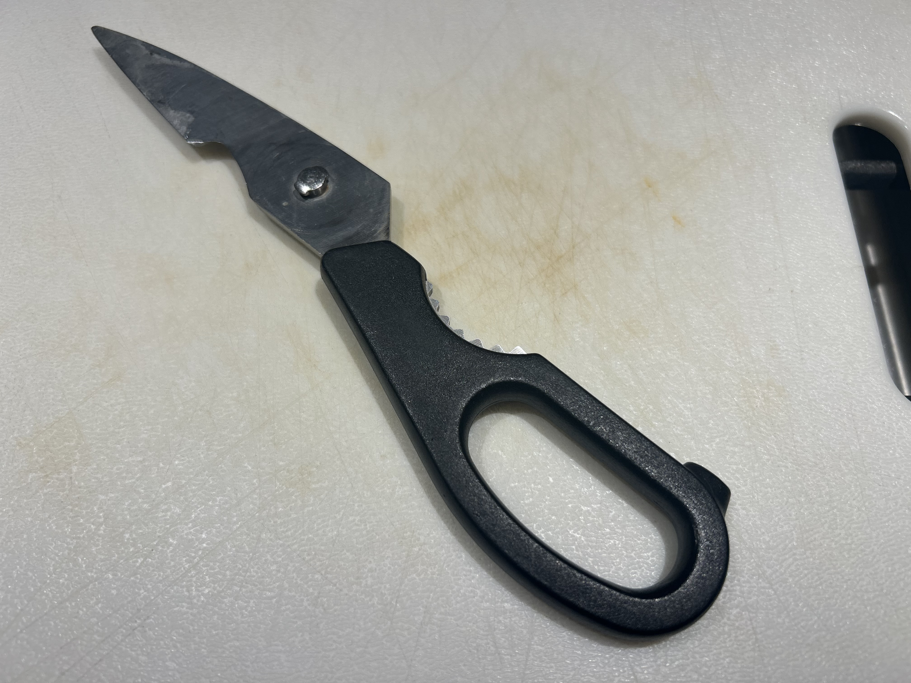
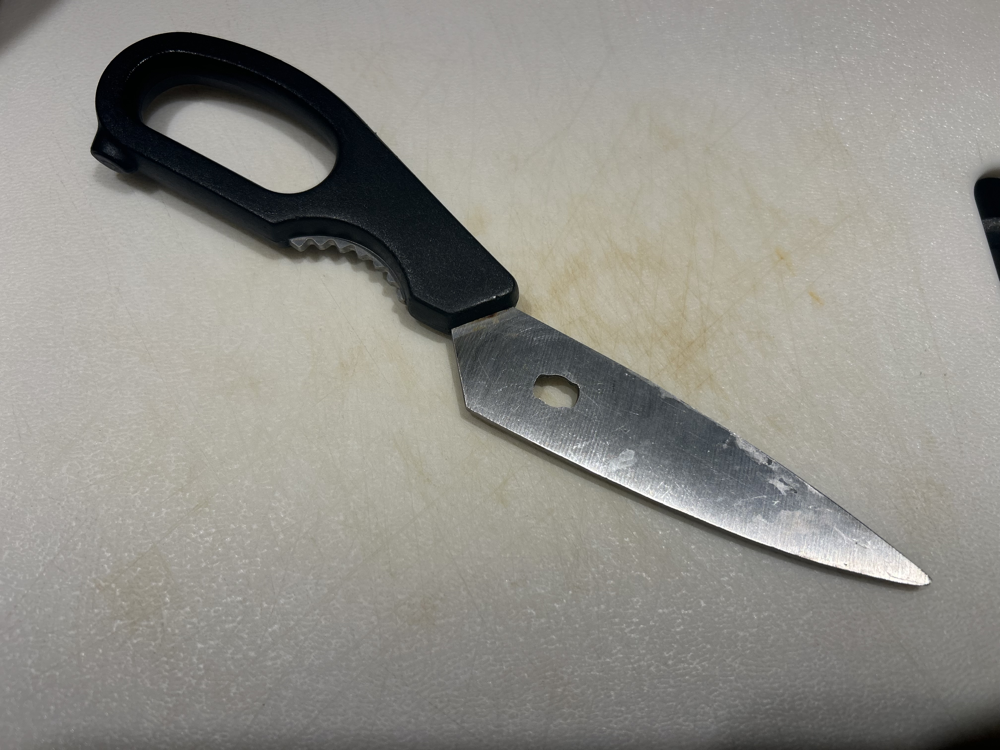

# A1 – [Portfolio Creation]

## Objective

## Analyze

**Task A - Portfolio Analysis**

Example Portfolio 1: [Tyler Wisniewski](https://tylerwisniewski.github.io/cev/)

**Navigability**

This portfolio contains a centralized tab dedicated to all of the available projects with pictures included, keeping the structure organized and the project catalogue quick to reach in just a couple clicks.  However, all of the projects are displayed as images without captions or titles.  This adds friction to what would be an intuitive layout because it forces the user to click through each since only a handful of the images reflect what the actual finished project is.

**Reproducibility**

The technical documentation of the projects shown is insufficient to allow someone to reproduce their project without asking questions.  Each page acts more as an informal reflection of the challenges faced, although some standout projects have CAD models and other schematics that share the work process.  A few cases also include full procedures, material lists, and other necessities for reproducing the project, but these aren't present on the portfolio and are instead delegated to links to lab reports. 

**Evidence of Reasoning**

The portfolio doesn't include a strong justification for the design choices that are present across most of the projects.  Instead, the final product or conclusion is typically given with little to no context.  Information is presented similarly to a resume, where the achievements are explained without the trade-offs, calculations, and analysis being included.  Because of this, it is difficult for the user to understand the engineering process of these projects without consulting the external the lab reports.

**Professionalism**

The professional tone necessary for a portfolio seen by potential employers is lacking.  Some of the pages contain selfies and memes that are irrelevant to the project and only hold value to the people included in the project, like an inside joke.  Even though this isn't reflective of the whole portfolio, replacing the informal media with the correct engineering terminology, graphical data, or removing them entirely would greatly improve the professionalism of the portfolio.

Example Portfolio 2: [Nathan Hoong](https://nhoong.github.io/)

**Navigability**

The assignments on this portfolio can be found in well under 60 seconds on the opening page which showcases a slideshow of images that contain CAD models, engineering drawings, and electrical schematics.  Each of the parts is paired with a title and description that explains the objective that it was meant to fulfill and the final result achieved.  Because of this concise structure, the user experience is very smooth and low-effort.

**Reproducibility**

Despite the inclusion of a title, description, and final result, the assignments lack the ability to expand the engineering drawings and other visual assets.  This makes it difficult to see important dimensions, tolerances, and materials that were used for these designs.  Downloadable CAD files for each of the parts are also not included, so reproducibility is limited since the final result would have to be remodeled from scratch.

**Evidence of Reasoning**

This portfolio doesn't provide the technical analysis behind the schematics that are given for each part.  Instead, the objective and final result are given, foregoing any design iterations or modifications that display what challenges were faced and what was changed to navigate around them.  The only additional information given comes from captions under specific CAD models or drawings, but these describe the perspective of the drawing, not what has changed.

**Professionalism**

All phrasing throughout the portfolio is consistently professional.  The author refrains from using informal language across the introduction or any of the design descriptions, only explaining what the objectives and results were in a very concise manner.  

**Task B - Product Analysis**

**Product Function**

The primary function of this product is to take two rotational input moments at the pivot point that connects the mating blades, and apply two opposing shear forces onto a target that will cause local mechanical shear failure in a straight line.  

**Governing Model**

$$F_{\text{in}} \cdot d_{\text{in}} = F_{\text{out}} \cdot d_{\text{out}}$$

$$\text{MA} = \frac{d_{\text{in}}}{d_{\text{out}}}$$

Variables:

$F_{\text{in}}$: The input force from the user's hand on the grip of the shears

$d_{\text{in}}$: The distance from the center of the pivot pin to the center of the grips

$F_{\text{out}}$: The output cutting force exerted by the blades onto the target object

$d_{\text{out}}$: The distance from the center of the pivot pin to the center point of contact for the cut

$\text{MA}$: The mechanical advantage of the system

**Governing Assumption:** Both components act as rigid bodies that experience minimal bending while cutting, guaranteeing that the full moment is transferred into the target surface at the center of the blades.

**Photograph Analysis of Kitchen Shears**

_Figure 1. A steel blade with a molded plastic grip that contains an extruding steel stud responsible for interlocking and enabling rotational movement_

_Figure 2. A matching steel blade opposite of the first with an opening designed to accept the stud and lock it in place during rotation_

**Patent Research**

_US Patent Number:_ US20070209213A1

_Author:_ Rama Chorpash

**Alternative 1 - Kitchen Knife**

Instead of two blades, a kitchen knife uses a single blade to accomplish the cutting operation against a secondary surface, such as cutting board.  Using the kitchen knife requires more manual control from the user over the angle and downward force, because there is no opposing blade to ensure the cut isn't jagged and is consistent through the material.

**Alternative 2 - Pizza Cutter**

A pizza cutter uses one circular blade that cuts along the edge when pressed with a downward force and rolled in a linear direction.  Similar to the kitchen knife, it requires another surface like a cutting board and more manual control from the user to  cut through the target material completely.

**Technical Design Decision**

I noticed from the geometry of the shears that the rotational position required to disengage and separate both blades far exceeds the standard operating range for cutting.  This decision was made to prevent accidental disassembly or damage to the shears from the components disengaging while in use.  Requiring the orientation of the blades to be at such an exaggerated angle keeps the blades secure during standard operation while still allowing for a wide range of motion and the ability to take them apart for cleaning.

## Decide

**Homepage Identity**

The homepage acts as a directory to all the information about this engineering record the viewer will want to see.  It contains tabs that label the sections of the portfolio, making it very easy for the viewer to pick out what it is they came here for.  If they came for the weekly assignments for example, they can click once on the designated tab and easily find every assignment in chronological order.  There is a banner and title at the top of the homepage that displays the author's name and the class this portfolio represents, which effectively communicates to the viewer what the assignments are based upon.  The standard for the portfolio is communicated through the main body of the homepage, where the structure of each assignment and the purpose of each pillar is explained.

**One Intentional Customization**

I updated the portfolio from the default typography to Public Sans for the body text.  This provides a slightly more spaced out and modern look to the text that improves readability.  This change overall ensures a clean visual hierarchy for the webpage, which helps direct the viewer's attention in densely worded sections.  The original typography was generic and blended together in a way that increased visual fatigue and diminished the standards presented.

**Your Documentation Standard**

I am committing to providing clear calculations, evidence, and ever-improving technical reasoning in my analysis for all of my submissions.

## Communicate

