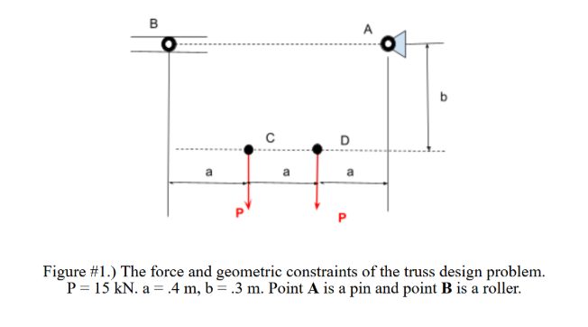
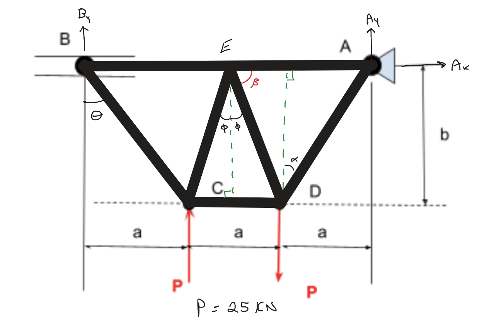
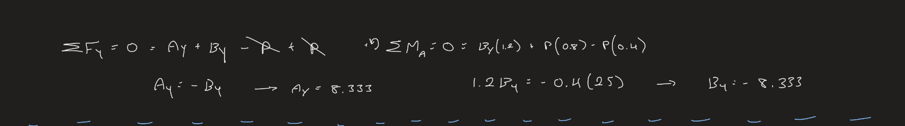
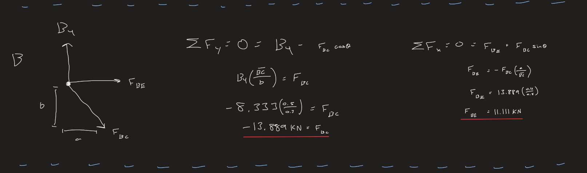
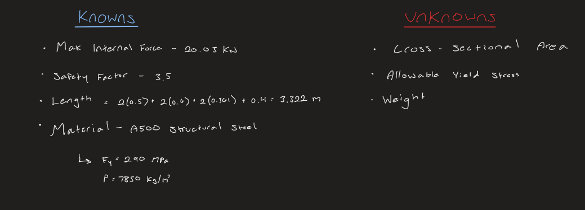
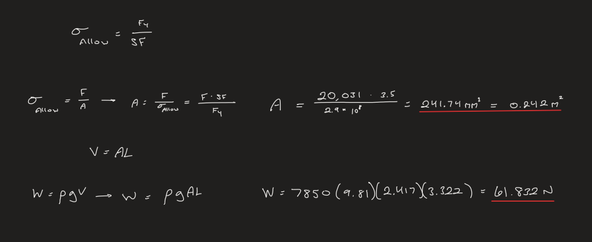
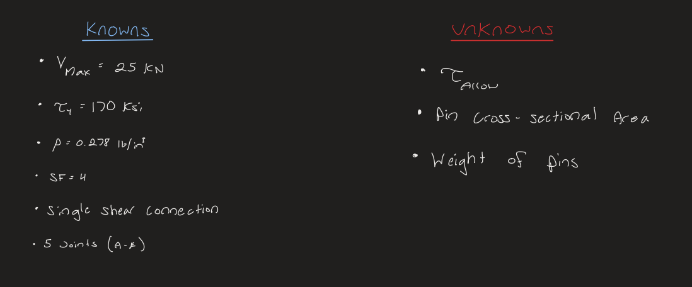
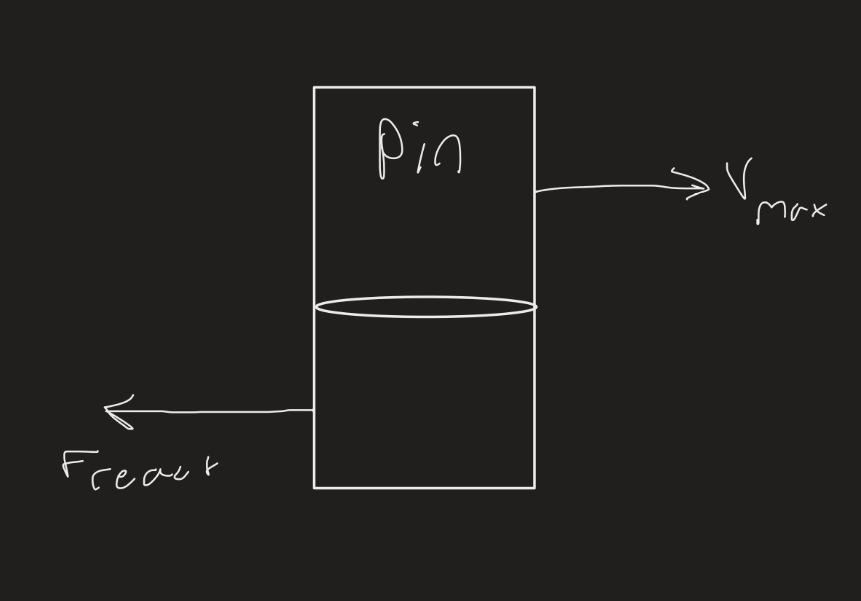
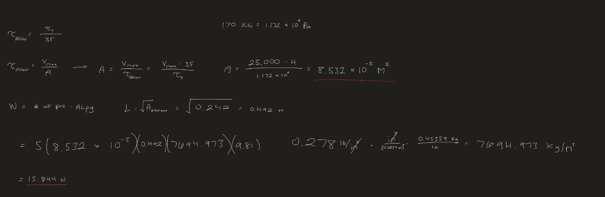

# A2 – Truss Stress Analysis

## Objective

Above are the parameters given for designing my own truss.  My approach to my design began with picking out the most straight-forward design that I could think of, I didn't want to work with a truss that had more components and internal forces than necessary.  I ended up falling on a basic design that I was familiar with from Statics.

## Design

This design is reliable for this assignment because it keeps the number of elements to a minimum. With the full truss laid out, I could examine the external forces and find the relationship between the vertical components of the supports at A and B.  A had an x component, but since there wasn't a matching external force I knew that this force would be equal to zero.

## **External Forces**

After marking down the forces on the truss FBD, I calculated Ay and By through the moment about A and the net force in the y direction where the P forces canceled out.  With two equations and two unknowns, I was able to solve for the magnitude of the forces in N.  The result was that I found the vertical components for A and B were opposite of each other.  

## **Internal Forces**

The pin at A has an additional force compared to the roller at B, so I chose to start at joint B for calculating my way through all the internal forces via method of Joints.  I first drew out the free body diagram and then wrote the net force equations in the x and y before isolating the force I wanted, which was Fbc and Fbe respectively in this case.  Then I inserted my known values and got the numerical forces of both.  I would occasionally need to add some extra calculations for necessary trigonometry when splitting force components.  This process was duplicated for every joint on the way to pin A.

After finding all the internal forces, I was able to pick out the two elements holding the maximum tension forces and maximum compression force, Fde and Fce, that would be used for calculating the minimum cross sectional area for all elements.  Since these elements will hold the strongest forces, finding the necessary cross sectional area will allow me the guarantee that it will be strong enough for the remaining elements without buckling.

## **Element Weight and Cross Sectional Area**

The first thing I did while preparing to find the necessary cross sectional area of my truss elements was list out what I did and didn't know that was related to my calculations, including the safety factor that was required of me.  This helped me out with remembering how exactly I needed to go about calculating the area, since it had been since before summer break that I took Solids.  

Same as when calculating the internal and external forces, I solved for the cross sectional area and weight for the elements symbolically first before inserting the values from the list of "Knowns," Most notably being the density and yield strength of A500 steel.  Once the cross sectional area was found, I could use it to find the length of the elements, one of the listed "Unknowns," which could be used to find the volume for weight.  For this assignment I opted to include all of the components in one equation to better keep track of each variable being used, so while I didn't solve for volume on its own, it is included in my weight calculation as AL (Area * Length).  This was multiplied by the density and force of gravity in order to arrive at weight.

## **Pin Weight and Cross Sectional Area**

Next, I applied the process that I used for the element area and weight to the pins.  The calculations were slightly different however, since the weight would be including each of the pins and the required safety factor is instead switched to 4.  This is likely because each of the pins are under a lot more stress than any of the elements, and it is vital that they are designed with specifications that are reflective of that stress.  With that in mind, I made another list of what I did and didn't know for the pins.

Alongside my calculations I also made a free body diagram that displayed the shear on the pins.  This helped to visualize the forces acting on them and how they should be designed.  While not as necessary for the coming calculations as previous free body diagrams, awareness of this relationships is still vital because of how important the pins are to the truss.

## **CAD**

[Truss Final Part](trussfinal.prt.1)

[Pin](pin_a02_part.prt.1)
