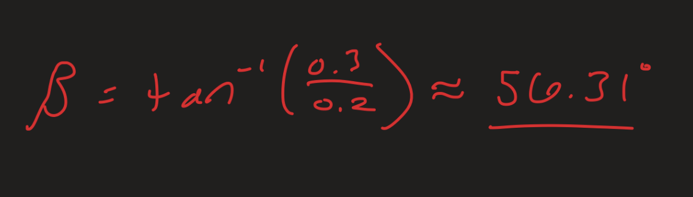
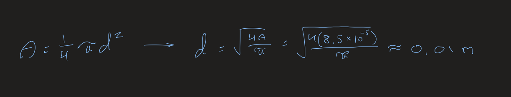
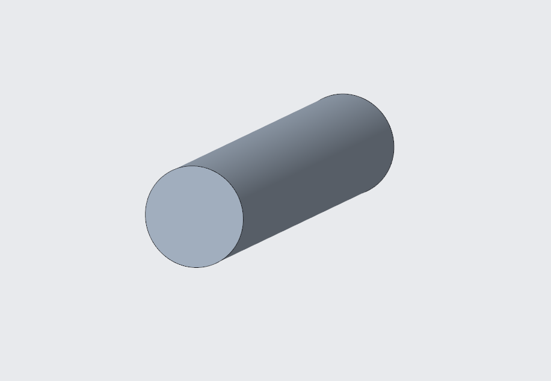
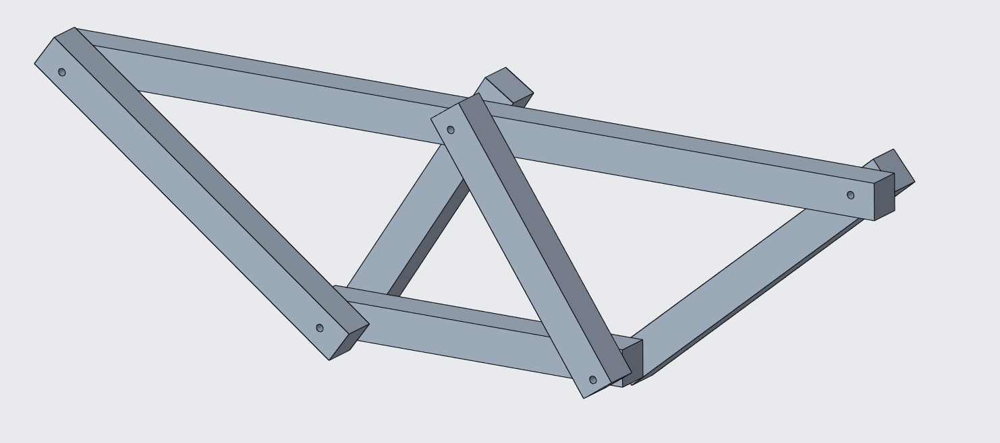
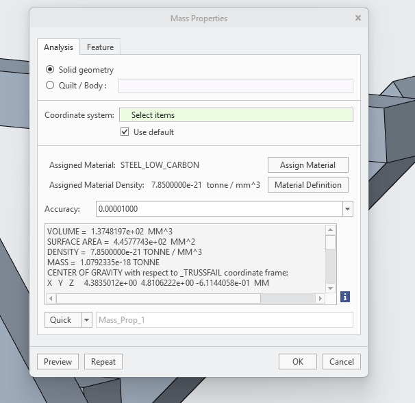

# A2 – Truss Stress Analysis

## Objective

Above are the parameters given for designing my own truss.  My approach to my design began with picking out the most straight-forward design that I could think of, I didn't want to work with a truss that had more components and internal forces than necessary.  I ended up falling on a basic design that I was familiar with from Statics.

## Design

This design is reliable for this assignment because it keeps the number of elements to a minimum. With the full truss laid out, I could examine the external forces and find the relationship between the vertical components of the supports at A and B.  A had an x component, but since there wasn't a matching external force I knew that this force would be equal to zero.

## **External Forces**

After marking down the forces on the truss FBD, I calculated Ay and By through the moment about A and the net force in the y direction where the P forces canceled out.  With two equations and two unknowns, I was able to solve for the magnitude of the forces in N.  The result was that I found the vertical components for A and B were opposite of each other.  

## **Internal Forces**

The pin at A has an additional force compared to the roller at B, so I chose to start at joint B for calculating my way through all the internal forces via method of Joints.  I first drew out the free body diagram and then wrote the net force equations in the x and y before isolating the force I wanted, which was Fbc and Fbe respectively in this case.  Then I inserted my known values and got the numerical forces of both.  I would occasionally need to add some extra calculations for necessary trigonometry when splitting force components.  This process was duplicated for every joint on the way to pin A.  This was a smooth process other than one bump at joint C, where my rounding had caused a force that was supposed to cancel out to zero have a slightly different value.  Because of my acknowledgement of it as a rounding error and being only being ~0.01 N off, I just rounded down.

After finding all the internal forces, I was able to pick out the two elements holding the maximum tension forces and maximum compression force, Fde and Fce, that would be used for calculating the minimum cross sectional area for all elements.  Since these elements will hold the strongest forces, finding the necessary cross sectional area will allow me the guarantee that it will be strong enough for the remaining elements without buckling.

## **Element Weight and Cross Sectional Area**

The first thing I did while preparing to find the necessary cross sectional area of my truss elements was list out what I did and didn't know that was related to my calculations, including the safety factor that was required of me.  This helped me out with remembering how exactly I needed to go about calculating the area, since it had been since before summer break that I took Solids.  

Same as when calculating the internal and external forces, I solved for the cross sectional area and weight for the elements symbolically first before inserting the values from the list of "Knowns," Most notably being the density and yield strength of A500 steel.  Once the cross sectional area was found, I could use it to find the length of the elements, one of the listed "Unknowns," which could be used to find the volume for weight.  For this assignment I opted to include all of the components in one equation to better keep track of each variable being used, so while I didn't solve for volume on its own, it is included in my weight calculation as AL (Area * Length).  This was multiplied by the density and force of gravity in order to arrive at weight.

## **Pin Weight and Cross Sectional Area**

Next, I applied the process that I used for the element area and weight to the pins.  The calculations were slightly different however, since the weight would be including each of the pins and the required safety factor is instead switched to 4.  This is likely because each of the pins are under a lot more stress than any of the elements, and it is vital that they are designed with specifications that are reflective of that stress.  With that in mind, I made another list of what I did and didn't know for the pins.

Alongside my calculations I also made a free body diagram that displayed the shear on the pins.  This helped to visualize the forces acting on them and how they should be designed.  While not as necessary for the coming calculations as previous free body diagrams, awareness of this relationships is still vital because of how important the pins are to the truss.

For the pin calculations, I needed to convert the units for the given density and yield shear so that they could be applicable to the rest of my values.  Included in these calculations is my work for the length of the pins, which I took to be the same as the width of the elements.  So, I took my minimal cross sectional area for my elements from my previous calculations and applied a square root in order to get the side length that represented the length of my pins.  This length was needed for finding the weight, which was again presented in a single equation with the components of pin volume included.

## **CAD**

This was the start of the most difficult part of this assignment for me.  I chose to use Creo because I had experience from previous classes, even if that experience was a little rusted.  I was also unable to get SolidWorks to properly install on my device, so I cut my losses and went back to Creo.  Amidst my struggling with modeling, I noticed I was missing an important parameter that was necessary for lining up the angular elements at joint E.  This was important because these where the most difficult parts to line up, and they needed to have the proper angle dimensions for me to have a chance at this working.  So, I went back into my notes and did another calculation so I could have the right angle value in my model.  This temporarily fixed by issue with this joint as a whole.

After much more struggling, I got my truss as close to my design as I could but I could also acknowledge a fair amount of flaws.  I was now looking at removing material for the pin holes at each of the joints, before I was reminded of another calculation I had forgotten.  In order to make holes for the pins, I needed to know the diameter of those pins.  I went back to my pin calculations and symbolically solved for diameter from the area formula, then inserted my minimum cross sectional area for the pins to get a value to use for the pin hole diameter.

After going back and making those changes, I was able to return to modeling in Creo.  With my new dimension I was able to make my simple pin design with the proper cross sectional area.

I now had a completed truss that was lined up as good as I could get it.  I extruded each piece in roughly the same order I went for the Method of Joints.  I treated my horizontal elements as my primary elements, and built off of them for my angled elements because they required more parameters to be available otherwise Creo wouldn't let them be properly defined.  This method turned out to be useful for helping me keep track of what elements were on either side of the primary elements.  All of my elements had the dimensions I calculated for them and were lined up the best they could be.  The most difficult component was Joint E, despite my use of construction lines, I was not able to get the pin hole to line up the way I expected it to.

I faced another hurdle when trying to implement mass properties because of the lack of A500 structural steel in the materials list, so I googled the options that were available to find the closest replacement that I could find.  This landed me at low carbon steel, which I believed to be the closest of the densities available in the Creo catalogue.  This, when calculated for the CAD weight, showed how flawed my design was.  My units did not properly line up between my calculations and my modeling, which made the design ineffective early into the modeling stage.  The numbers I calculated were put into Creo at the default unit, which was inches, and I kept my numbers in meters.

[Truss Final Part](trussfinal.prt.1)

[Pin](pin_a02_part.prt.1)

## **Communication**

In my technical analysis, I got to experience how critical the necessity of consistency in units is.  My design, which I was confident in, very quickly deteriorated when I wasn't able to clarify my units properly in Creo.  While in the default inches for Creo I was putting my dimensions in as meters, when they should have been in millimeters to keep up with better consistency.  This led to me not being able to properly validate my dimensions with each other in my truss, and it was creating more difficult obstacles with each passing element that I tried to add.  These struggles only added to the time I dedicated to the assignment, and my frustration going forward, leading to other potential mistakes.  This assignment has helped remind me to compare hand written calculations with digital modeling dimensions consistently and thoroughly to ensure complete correlation between them.

This assignment took me 16 hours.

