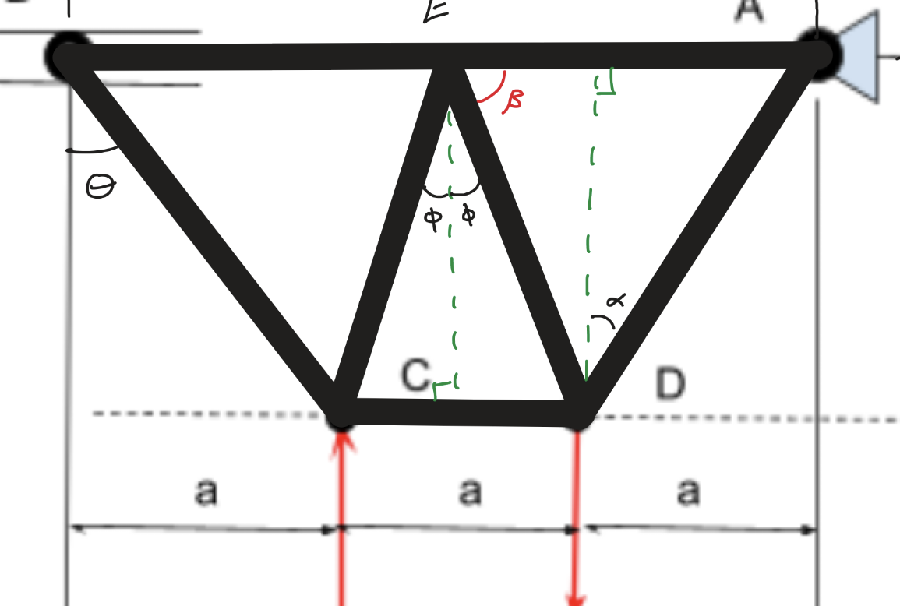

# A2 – Truss Stress Analysis

## Objective

Above are the parameters given for designing my own truss.  My approach to my design began with picking out the most straight-forward design that I could think of, I didn't want to work with a truss that had more components and internal forces than necessary.  I ended up falling on a basic design that I was familiar with from Statics.

# Design

This design is reliable for this assignment because it keeps the number of elements to a minimum. I wasn't able to come up with a design that had fewer elements than this, which isn't a problem because the order of events for solving for internal forces isn't complicated at all.  The work was tedious and time consuming for sure, but not difficult.

[Truss Final Part](trussfinal.prt.1)
