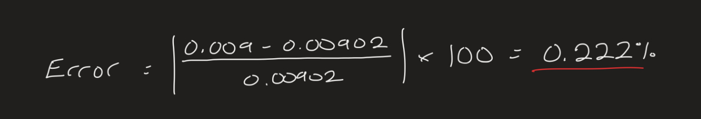

# A3 – [Topic]

## Objective

The objective of this assignment was to design a circular beam with maximum deflection of 0.009 inches, an applied load between 300 and 500 lbf, and an elastic modulus between 8.5 - 11.5 x 10^6 psi.  Using the above parameters, I will model the beam in SolidWorks, use parametric design to determine the length of the bar, run Finite Element Analysis (FEA), and compare the results to my hand-drawn calculations to find discrepancies.

## Analyze

# **Hand Calculations**

To start, I chose a diameter which I could use to calculate the cross-sectional area.  I decided to go with a 4 inch diameter because I didn't have a good reference ahead of time,  but I would return to revise this step.  I also chose a 400 lbf load, and 10*10^6 psi modulus.  I then found the cross-sectional area and placed it into the equation for elongation from the Machinery's Handbook which was reconfigured to find the length of the beam.  After seeing how large this length was, around 3000 inches, I decided to go back and alter my initial diameter to 1 inch, simplifying my area calculation and trimming the length of my beam.  I was now ready to model the beam in SolidWorks.

# **CAD**

[A03 Part](A03.SLDPRT)

With my finished model, I went into the equations tab and did my calculations over again.  This time assigning variables for all of the values I used in my hand calculations and confirming my beam length calculation.  The beam was still a little long after seeing it modeled, but it was decent enough to justify leaving it as is.

# **FEA Generation**

Preparing to run the study for the FEA, I assigned one of the aluminum materials that were available.  Because none of them had a modulus that matched the one I had selected, or was around the given range, I chose the closest pick that I found.  With the material in place, I placed fixed geometry on one end of my beam and my applied load of 400 lbf facing the other direction on the opposite end.  Finally, I added the mesh to the beam with the default conditions and ran the study.

First I looked at my deflection map generated in the FEA.  The maximum deflection shown in the FEA was 0.00902 inches.  This result stood up to the initial parameters given very well.

After analyzing my von Mises stress map, I saw that my maximum stress was 555.1 psi or 0.555 ksi.  This falls far below the strength of aluminum given, 40 ksi, however this would mean that the beam has a safety factor of about 72.  This is a notably large safety factor, and most likely relates back to the material selected through SolidWorks not being a direct match with the properties chosen at the beginning.

## Decide

# **Design Reflection**

Comparing the deflection in inches given and the deflection gathered from the deflection map in SolidWorks, there is virtually no difference between them.  Calculating the percent error, there is a less than one percent difference between them.  I would expect them to be the same because the dimensions closely compare to the dimensions in the hand calculations with no holes and are combined with simple axial loading.  The negligible difference is a sign that the mesh doesn't need to be changed because there aren't any stress hotspots.  I would overall trust the parametric design more because the CAD model showed a large safety factor in the von Mises stress map, implying that their may be an issue with the design's parameters in SolidWorks, specifically with the material selection.

Assuming a pin hole with a diameter of a quarter of an inch, the relationship between the pin diameter and beam diameter would be 0.25.  Using Peterson's chart, the stress concentration factor (Kt) for a round beam with a hole and axial loading would be around 2.4.  Taking the 555.1 psi nominal stress from the FEA, and multiplying it with the stress concentration factor, would give 1332.24 psi for the peak stress at the hole.  This would still fall well under the 40 ksi strength of aluminum given.

## Communicate

The biggest mistake I made during this assignment was choosing parameters without looking at the material properties available on SolidWorks first.  I saw the range given for Young's Modulus (8.5-11.5 multiplied by 10^6) and chose 10 because it was a clean number in the middle of the range.  Had I checked the material list first, I would've selected 8.5 because it was a lot closer to the options available.  It wouldn't have been perfect, but it likely would've improved the massive safety factor that I calculated from the von Mises stress map.

I spent 4 hours on this assignment.
