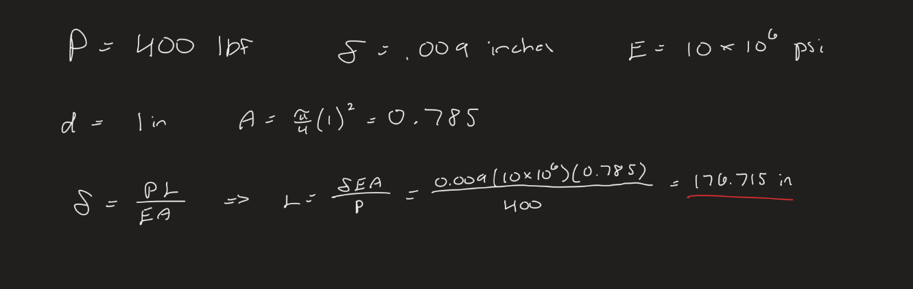
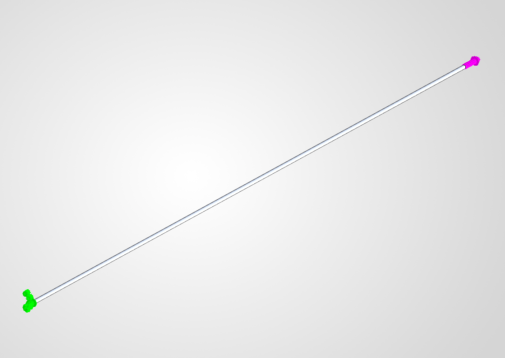
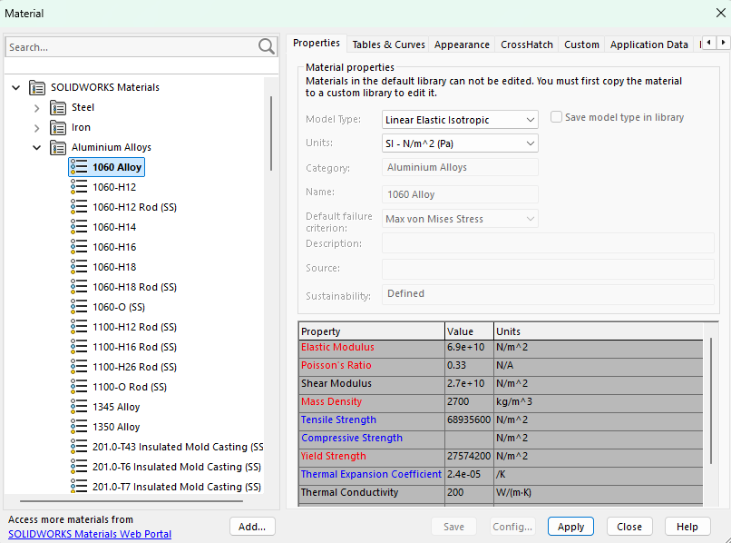
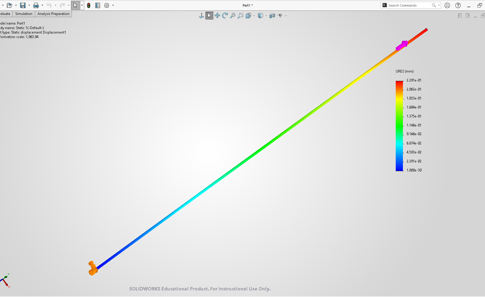
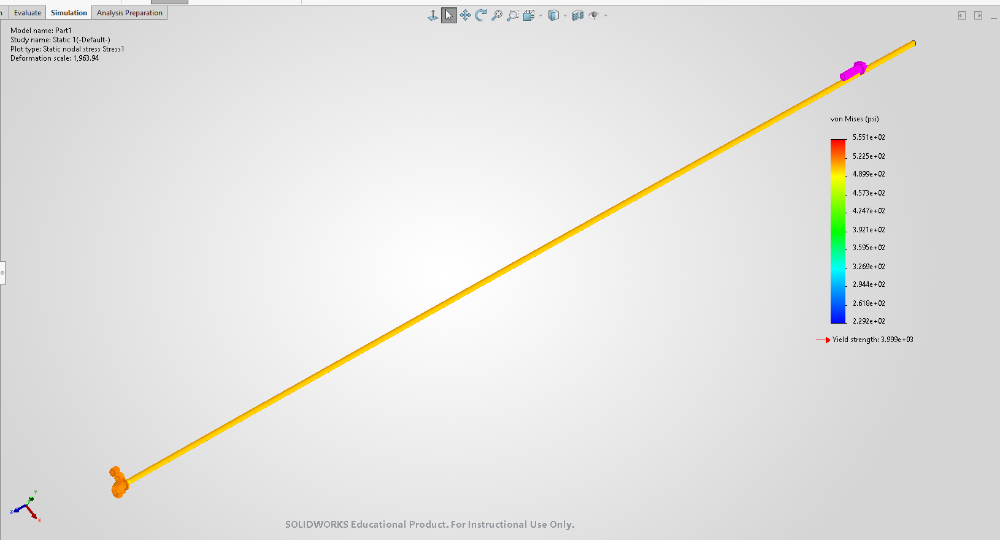

# A3 – [Topic]

## Objective

The objective of this assignment was to design a circular beam with maximum deflection of 0.009 inches, an applied load between 300 and 500 lbf, and an elastic modulus between 8.5 - 11.5 x 10^6 psi.  Using the above parameters, I will model the beam in SolidWorks, use parametric design to determine the length of the bar, run Finite Element Analysis (FEA), and compare the results to my hand-drawn calculations to find discrepancies.

## Analyze

# **Hand Calculations**

To start, I chose a diameter which I could use to calculate the cross-sectional area.  I decided to go with a 4 inch diameter because I didn't have a good reference ahead of time,  but I would return to revise this step.  I also chose a 400 lbf load, and 10*10^6 psi modulus.  I then found the cross-sectional area and placed it into the equation for elongation from the Machinery's Handbook which was reconfigured to find the length of the beam.  After seeing how large this length was, around 3000 inches, I decided to go back and alter my initial diameter to 1 inch, simplifying my area calculation and trimming the length of my beam.  I was now ready to model the beam in SolidWorks.

# **CAD**

With my finished model, I went into the equations tab and did my calculations over again.  This time assigning variables for all of the values I used in my hand calculations and confirming my beam length calculation.  The beam was still a little long after seeing it modeled, but it was decent enough to justify leaving it as is.

# **FEA Generation**

Preparing to run the study for the FEA, I assigned one of the aluminum materials that were available.  Because none of them had a modulus that matched the one I had selected, or was around the given range, I chose the closest pick that I found.  With the material in place, I placed fixed geometry on one end of my beam and my applied load of 400 lbf facing the other direction on the opposite end.  Finally, I added the mesh to the beam with the default conditions and ran the study.

First I looked at my deflection map generated in the FEA.  The maximum deflection shown in the FEA was 0.00902 inches.  This result stood up to the initial parameters given very well.

## Decide

## Communicate

