# A4 – [Topic]

## Objective

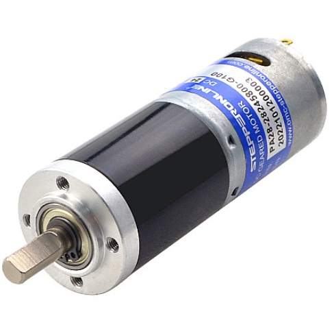

The goal of this assignment was to design a motor mount that could attach to a rigid wall and hold up the motor above.  All of the motor specs were provided on the website where the image was taken A few other values were given or selected, such as the 300 N load, my choice of material, and initial lengths for the features.  I decided to go with ABS as my material and 34 mm for the width of both features.

## Feature 1

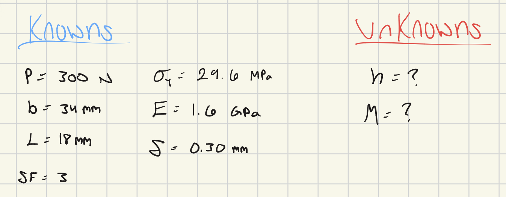

Getting ready to work on the first feature, I wrote down everything I knew the value of and needed to find that was relevant to the first feature.  I would reference this again when it was time to insert values after solving for what I needed symbolically.  This step is always helpful for keeping myself focused on what I am supposed to be working on.

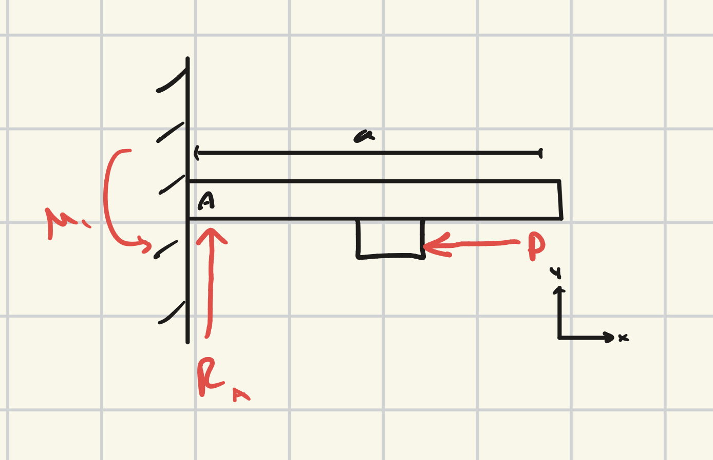

After putting down my knowable values, I put drew a FBD of the first feature.  By this point in the process, the final technical appearance wasn't completely clear, but it was certain that it would behave as a cantilever beam so it came out resembling a typical beam image as opposed to the final product.

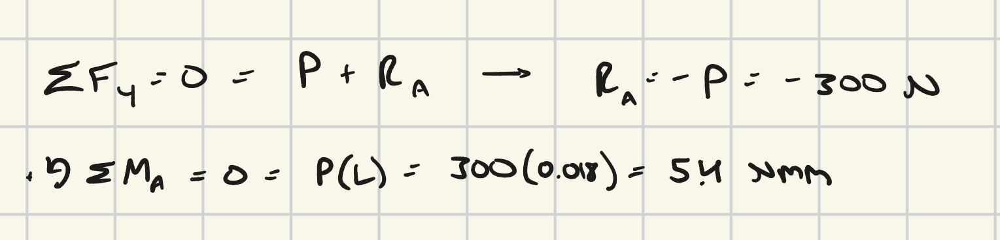

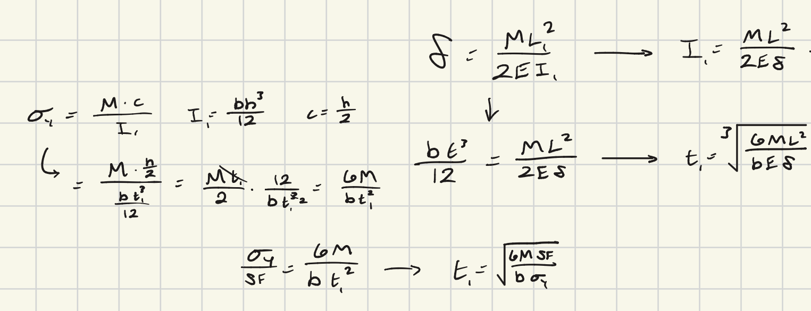

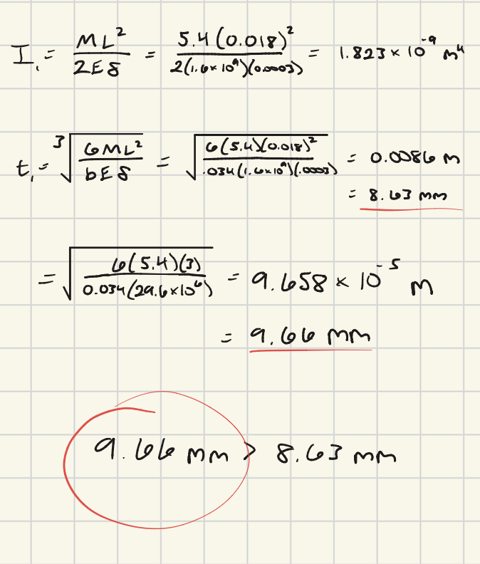

## Feature 2

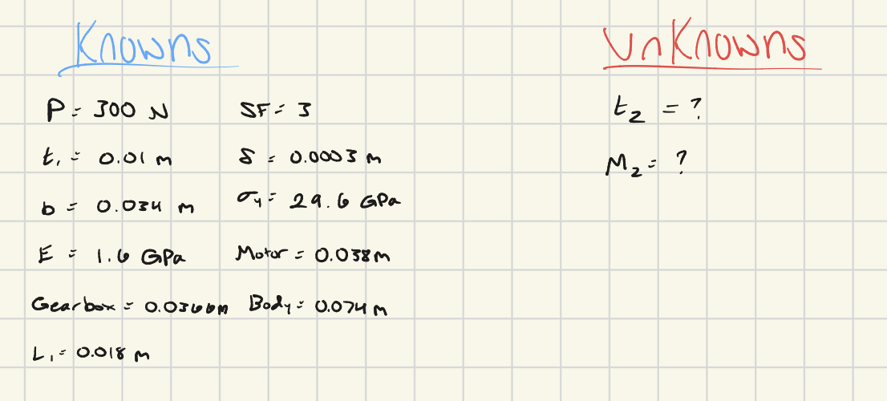

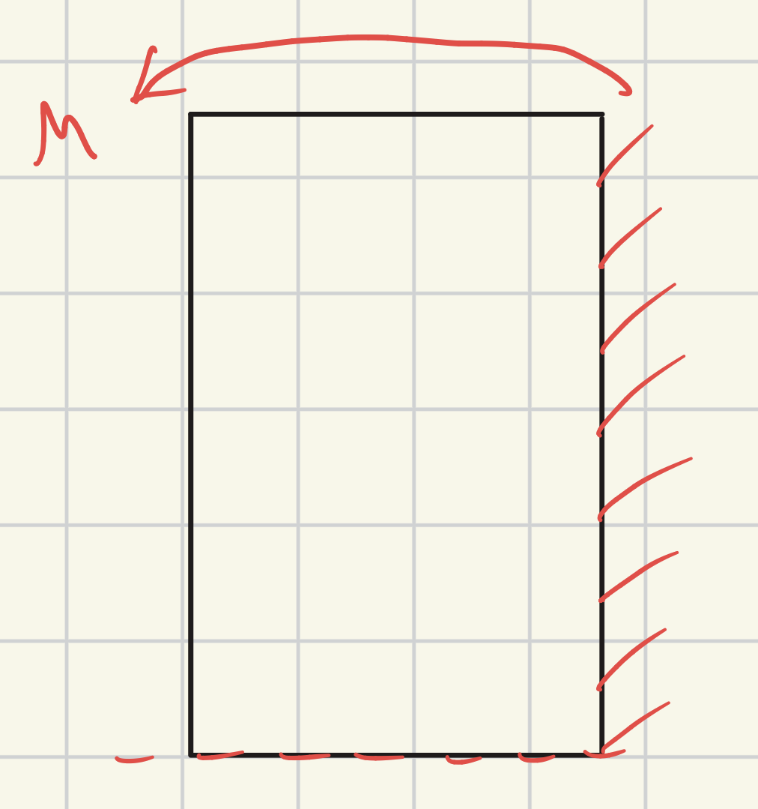

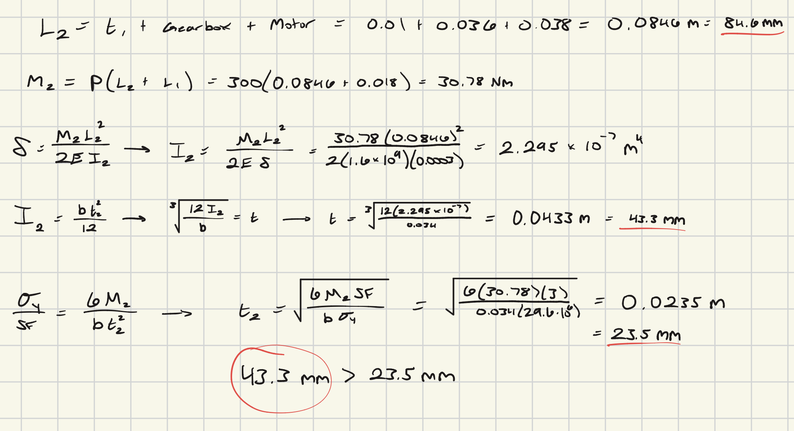

## Sketch

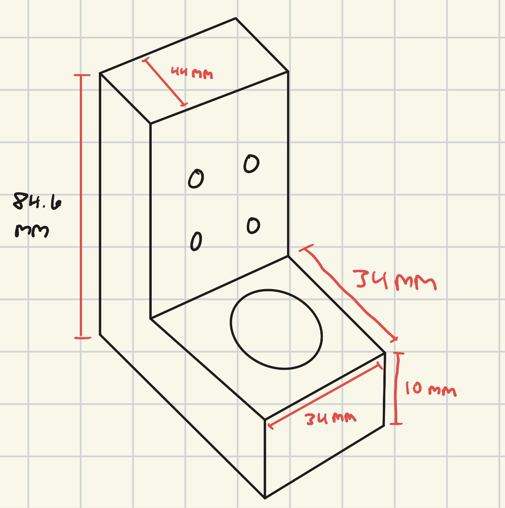

## CAD Model (Parametric)

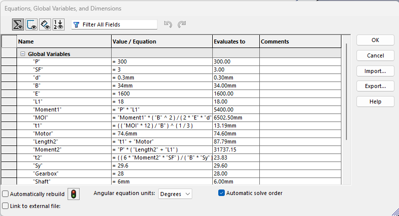

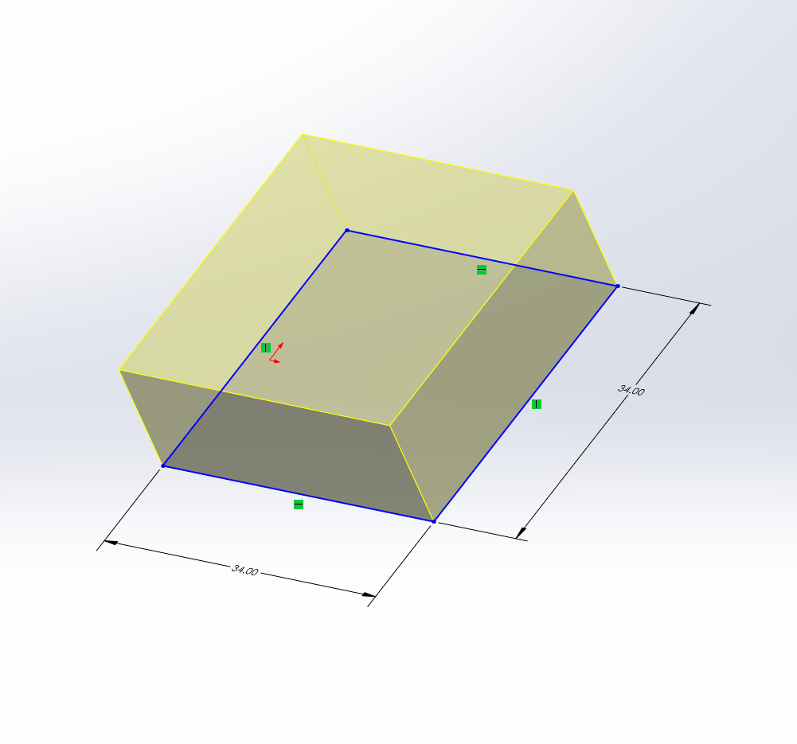

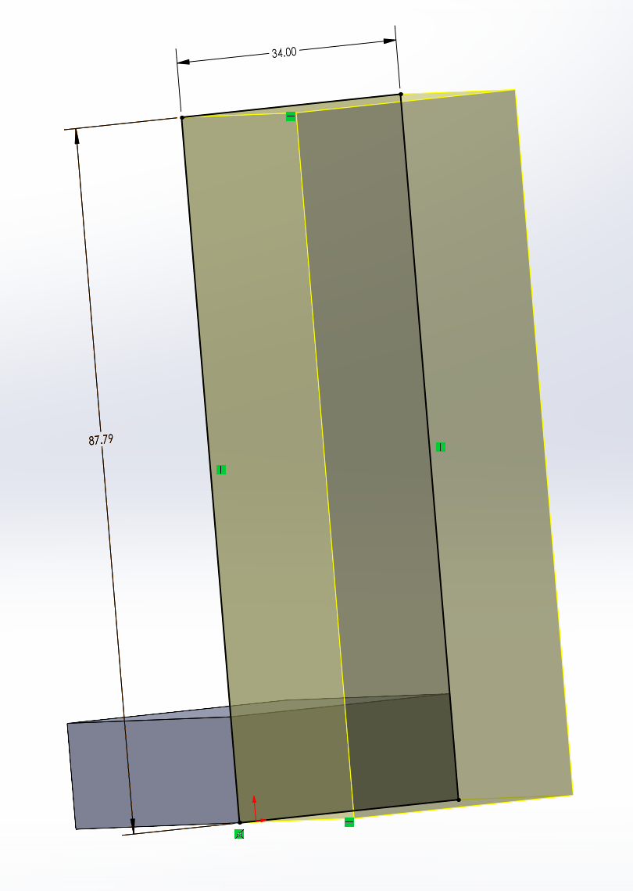

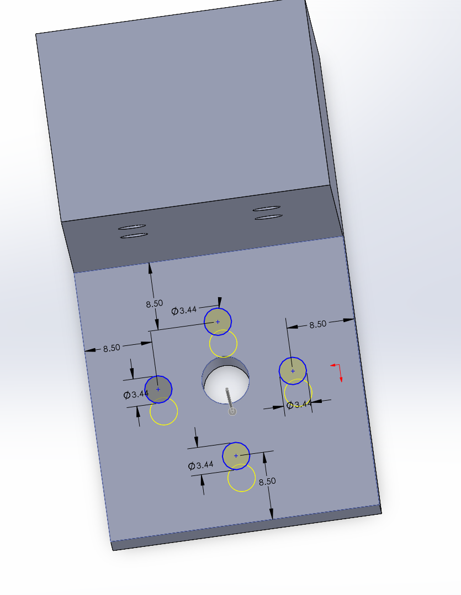

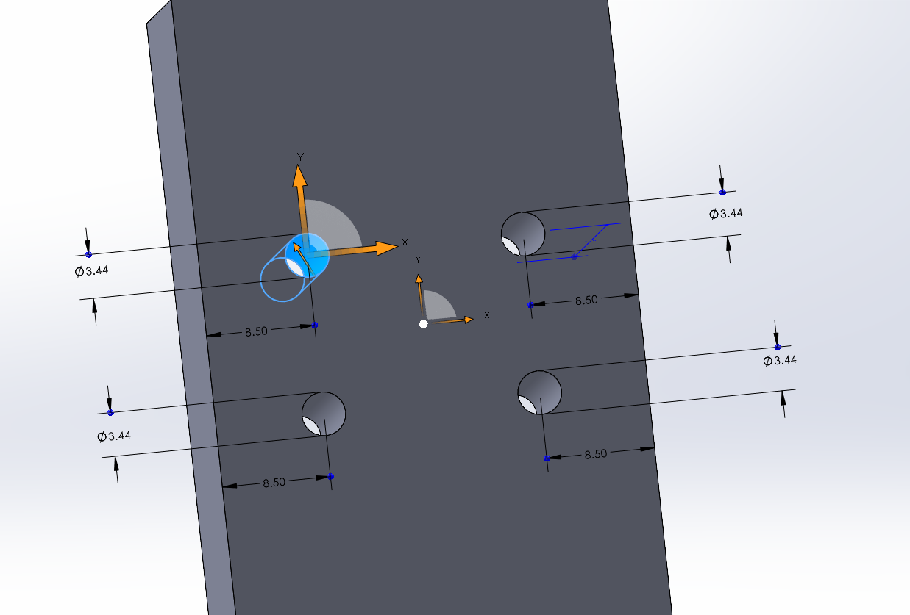

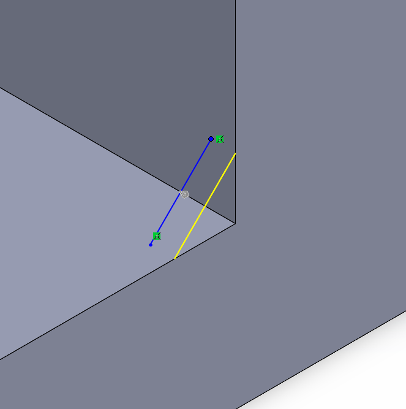

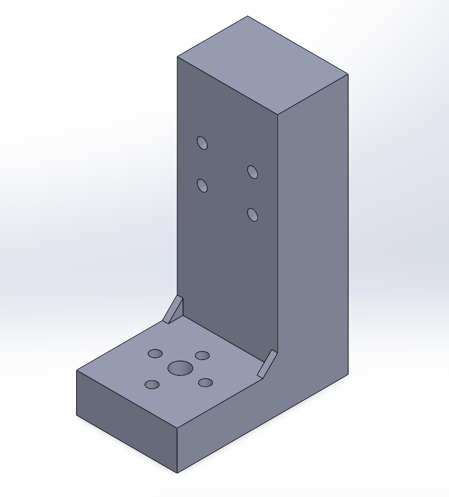

[A4.SLDPRT](A4.SLDPRT)

## Communicate

This assignment took 7-8 hours to accomplish.
