# A5 – Bracket Design

## Objective

The objective for this assignment was to design a bracket based on the concept design found in the appendix.  Using the given information, ASTM A36 steel, an applied load of 600 lbf, and my own assumptions about the geometry based on the data at my disposal, I will be able to determine the required dimensions of features A-E through stress and stiffness analysis.  Both sections of my work will be completed through a concise and consistent process that shows how I navigated through each feature and what assumptions I felt were necessary to complete my calculations.  While the calculations would be different, both sections will share my knowns, unknowns, and the assumptions I made for each feature.

## Stress Analysis

For the stress analysis portion, the most important information given was that I would be designing with a safety factor of 4 in mind.  I would use this with the yield stress of my chosen material to calculate the chosen dimension through stress equations that would be used for the next feature.  I would manage to run into a few errors during this process however.

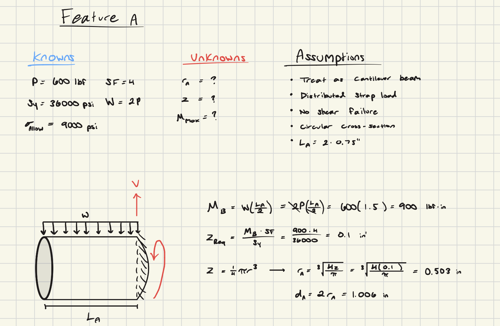

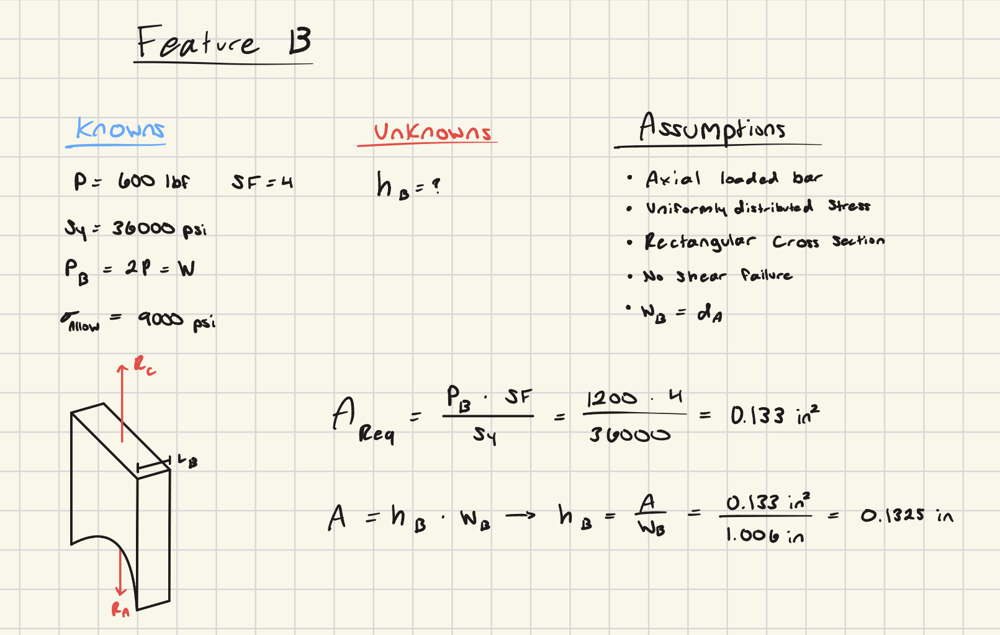

The biggest problem I had with this section which required me to return and redo it was having inconsistent notations for my features.  Feature B was the root of this issue because of its design in the isometric view given, where I took the long dimension of the cross sectional area to be length.  This doesn't seem like an issue, however it is the opposite orientation that I chose for the rest of the features.  I had to rework what I was considering width and length from scratch, so that I could have a clearer consistency going forward when I would start carrying over dimensions for future features.

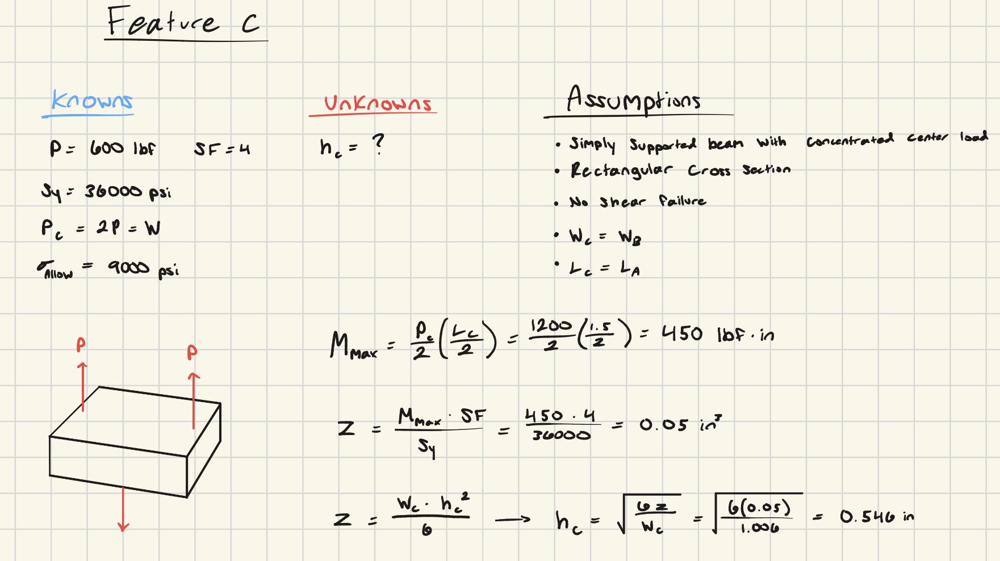

Starting with feature C and all the way to E, I found myself making difficult assumptions in order to complete my calculations.  For each of these features, I would struggle to make the assumptions that side lengths carried over because of the concept design not giving a clear angle of each feature.  Even though it is a guide and not exactly how my bracket would come out to be, I wasn't sure which assumptions I was allowed to make, so I did my best to eyeball what I needed based on what I could see in the concept design.

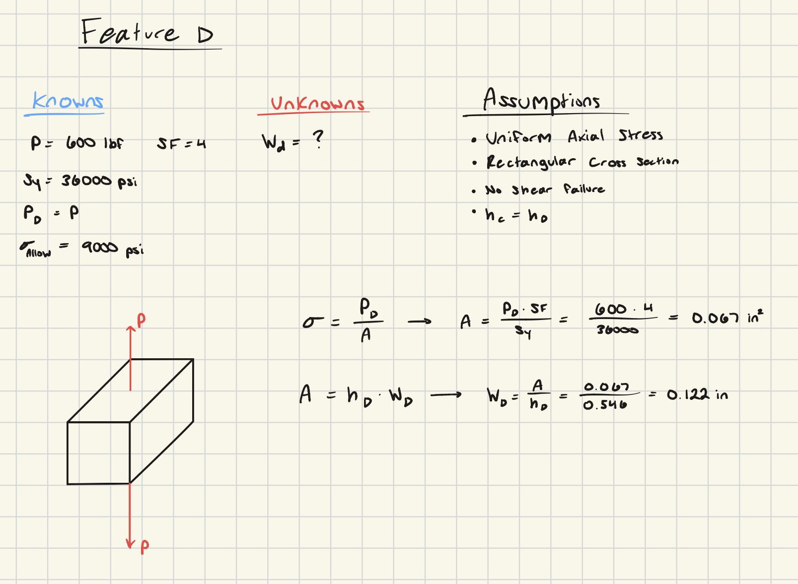

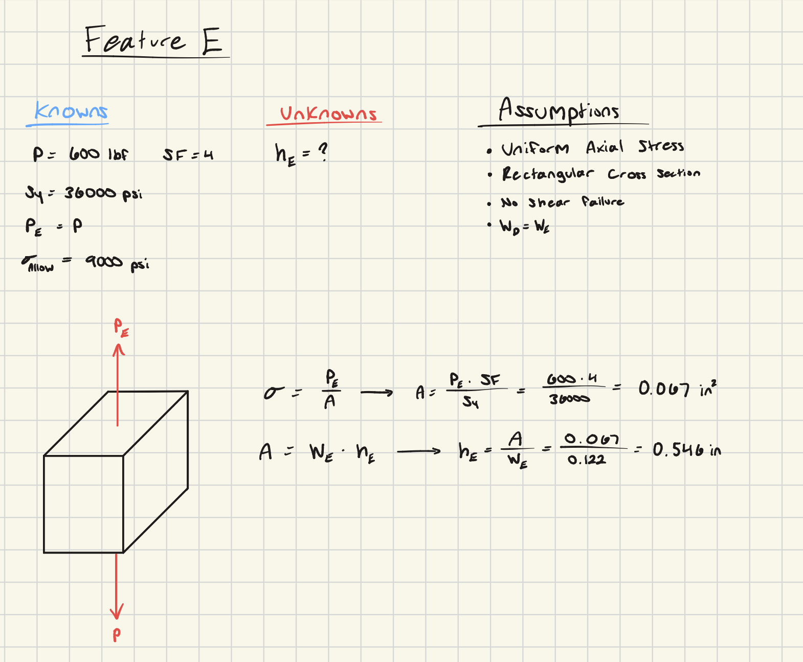

## Stiffness Analysis

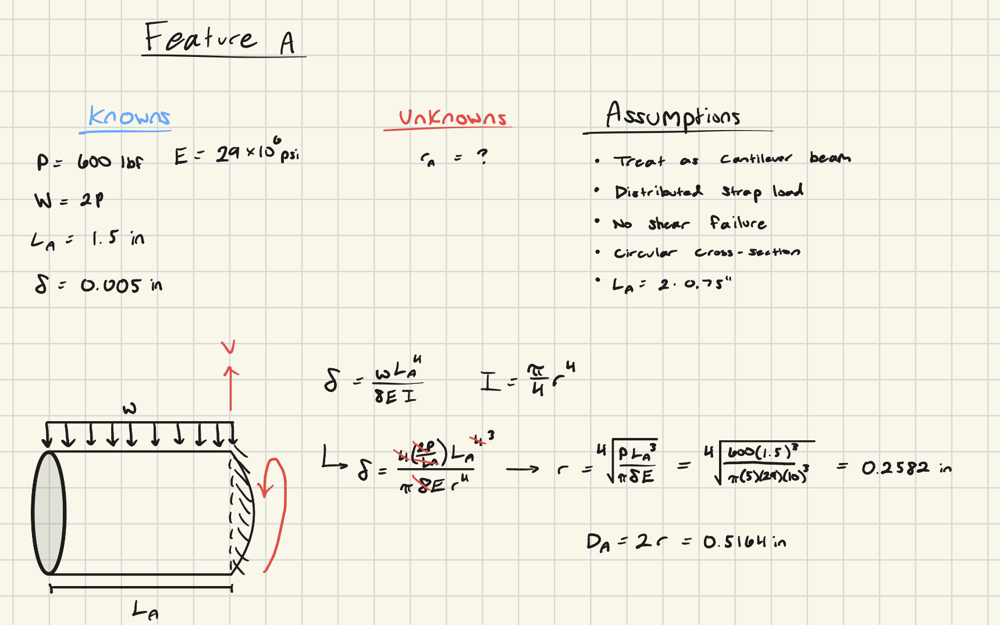

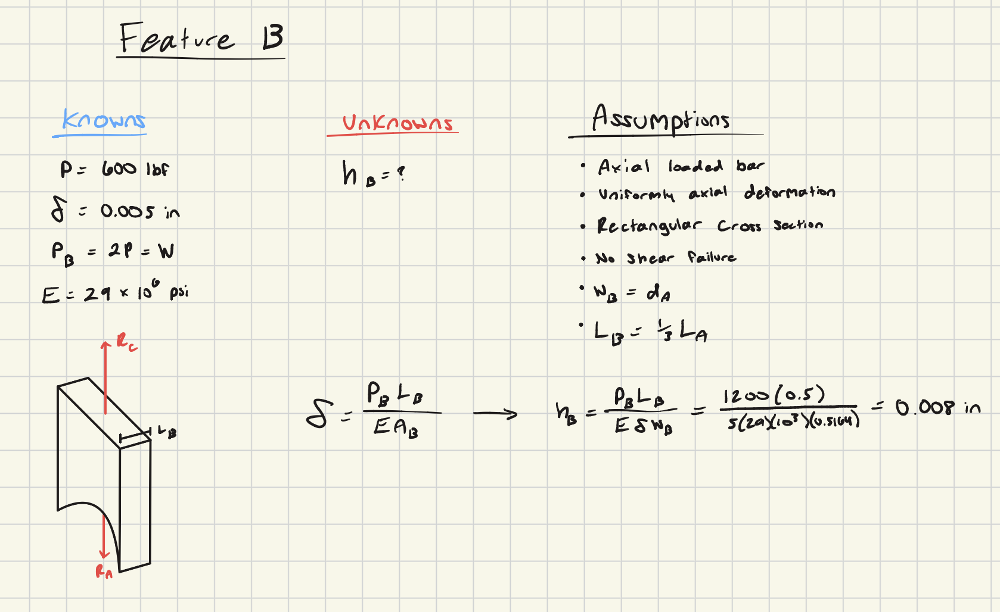

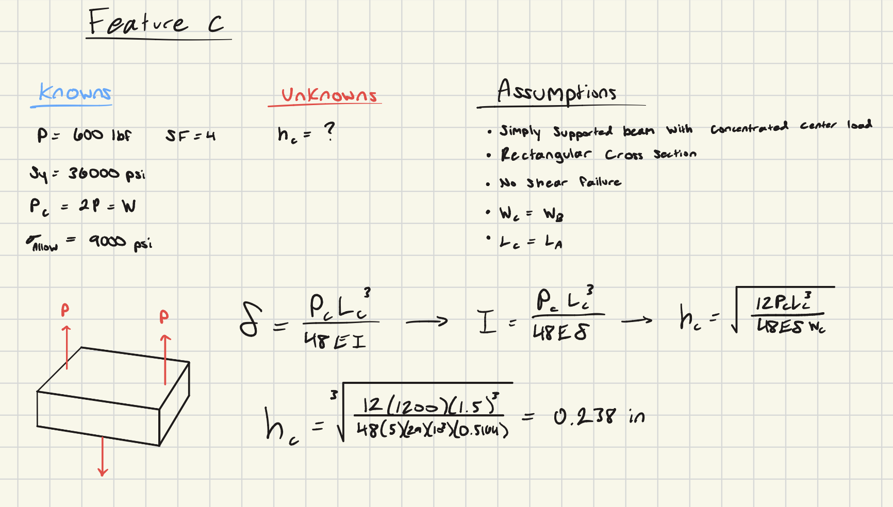

Same as when I hit feature C in the stress analysis, I struggled with my assumptions for this feature onward.  This mostly stemmed from my lack of understanding the gap in my numbers, since this mostly left me feeling like I was doing something very wrong.  common sense applied to some of these results did not help this concern, so my approach would require a shift in multiple occasions through this section as well.

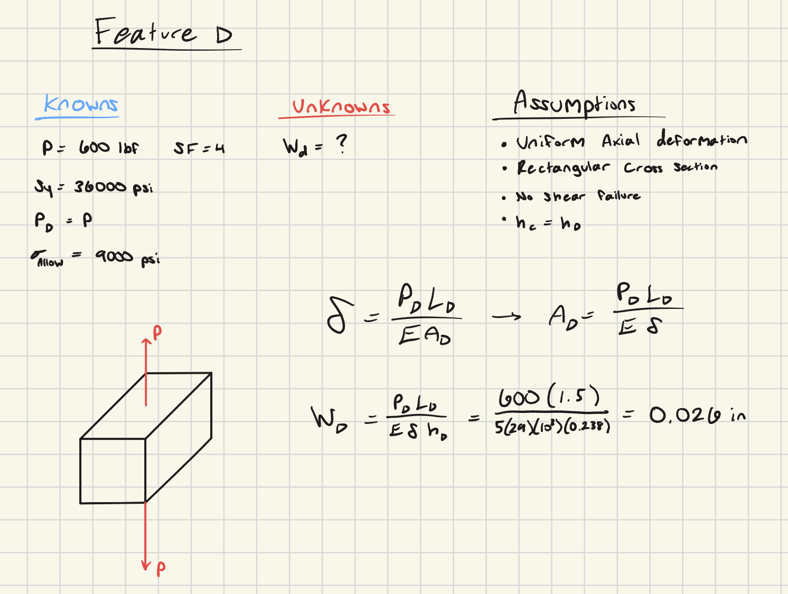

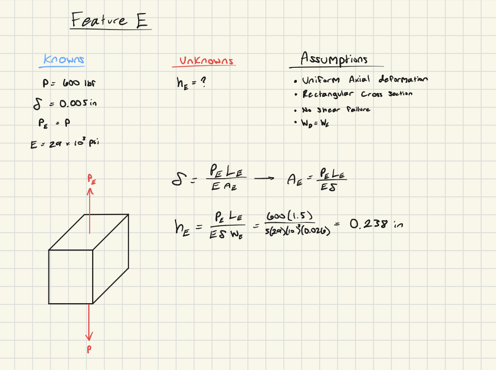

## Multiview Sketches

Below I compiled all of my results into two orthographic drawings, one for stress and one for stiffness.  This presentation helped to show the differences and similarities between my work in both analyses, namely that the numbers are all different but also how the same two dimensions are equal in both drawings.  This may have been due to similar assumptions being made in both, but overall I am not sure what to make of it.

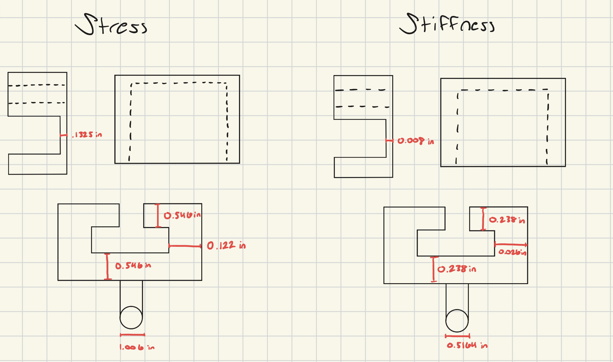

## Communicate

