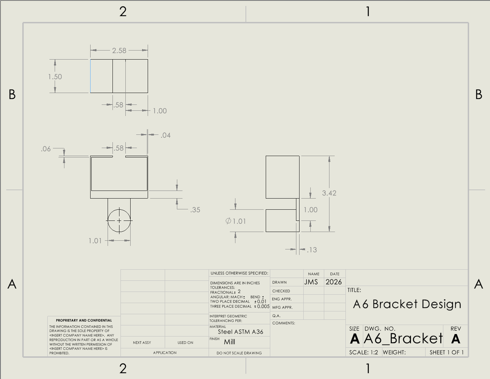

# A6 – Bracket Drawing

## Objective

The objective of this assignment was to take the results from last weeks assignment and create a drawing in third angle projection after utilizing parametric design in SolidWorks.  For my model, I used my stress calculations since those were determined to be my governing calculations.

## Parametric Design

First, I needed to take my work from last week and recreate it in CAD. The majority of my dimensions came directly from the equations tab.  I had no issues translating my work for the first three features, but D and E would take a while because I wasn't satisfied with their extra long design.

For this feature, I had to make a slight change to the height.  After the initial extrusion, I found the part to be short enough that feature A and C would be touching.  Because of this, I made the executive decision to double the height so that there was enough room for the remaining features to not interfere with each other.

I came to the unfortunate realization that I had left out an important piece of both this weeks and last weeks assignment, showing the dimensions of the T-beam that needed to fit inside the bracket.  This was a large part of why my bracket was so tall, so by reworking feature D and E, I was able to get my bracket a little more accurate to the given specifications.  The downside was that the thickness for both was incredibly thin compared to the rest of the bracket.  This was concerning, but I couldn't do much about it since that is what my results came to while allowing the beam to slide into the bracket.

## Drawing

## Reflection

This assignment took me 5 hours.
