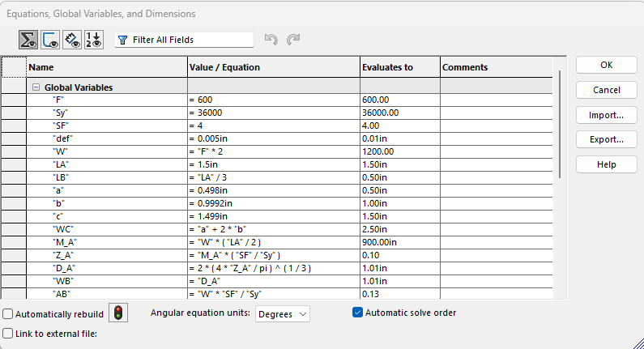
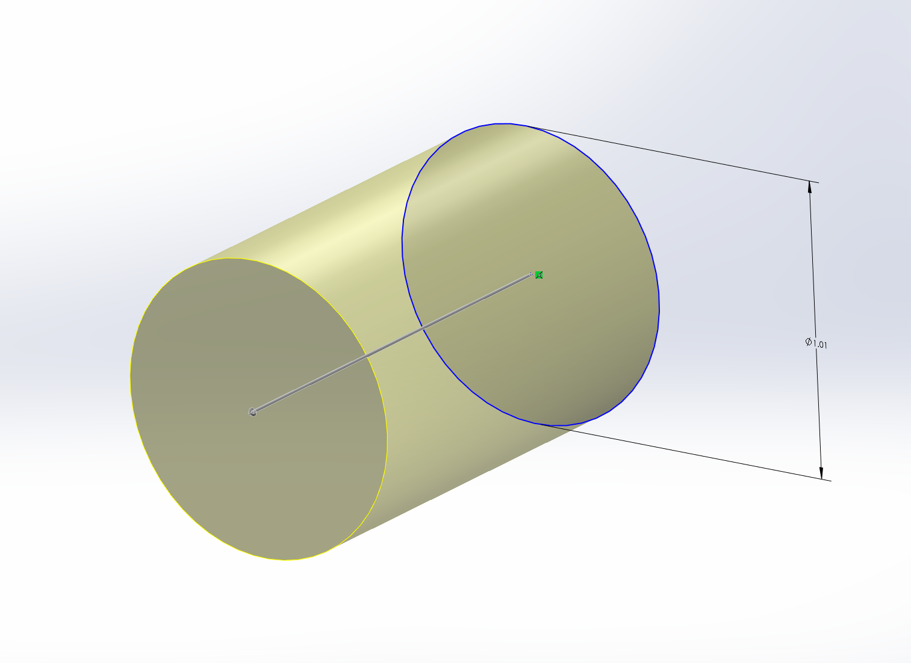
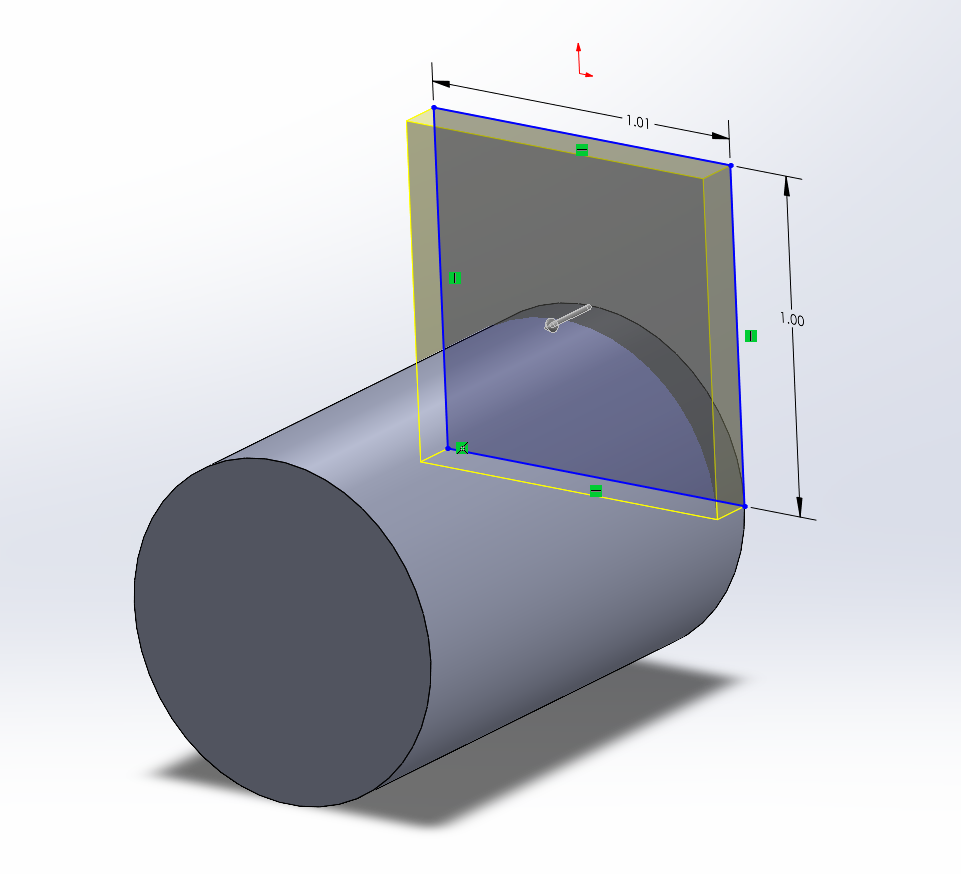
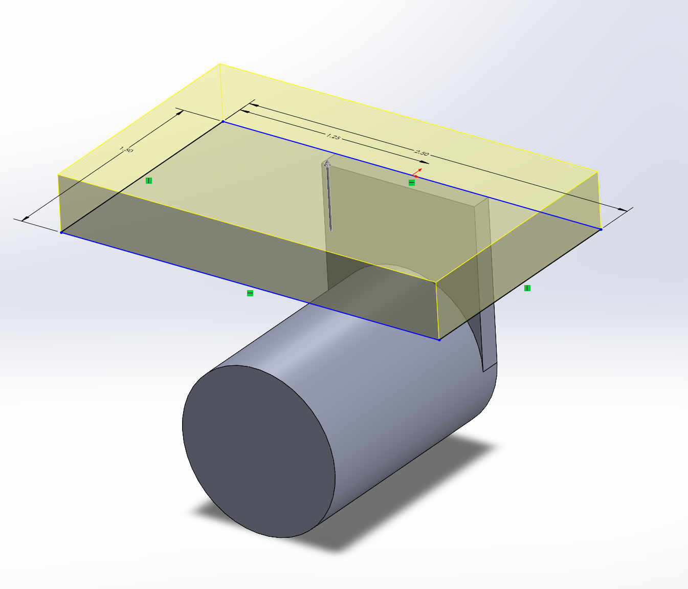
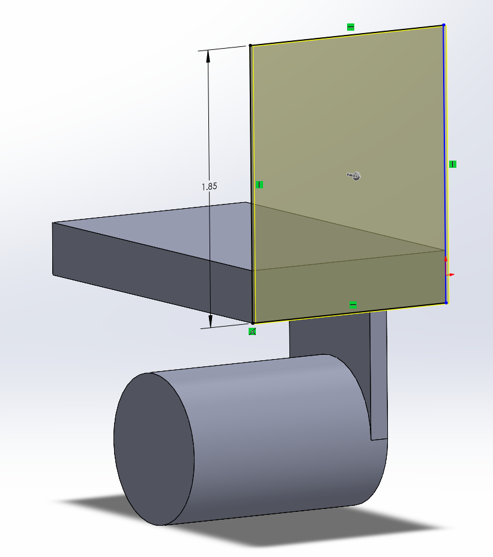
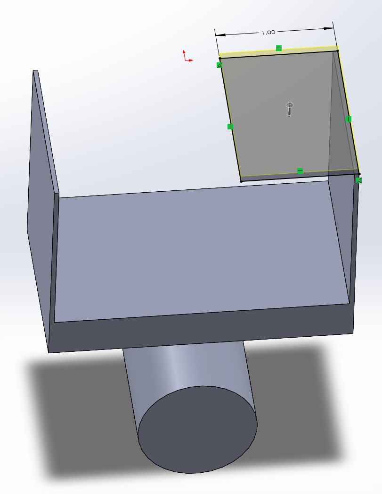
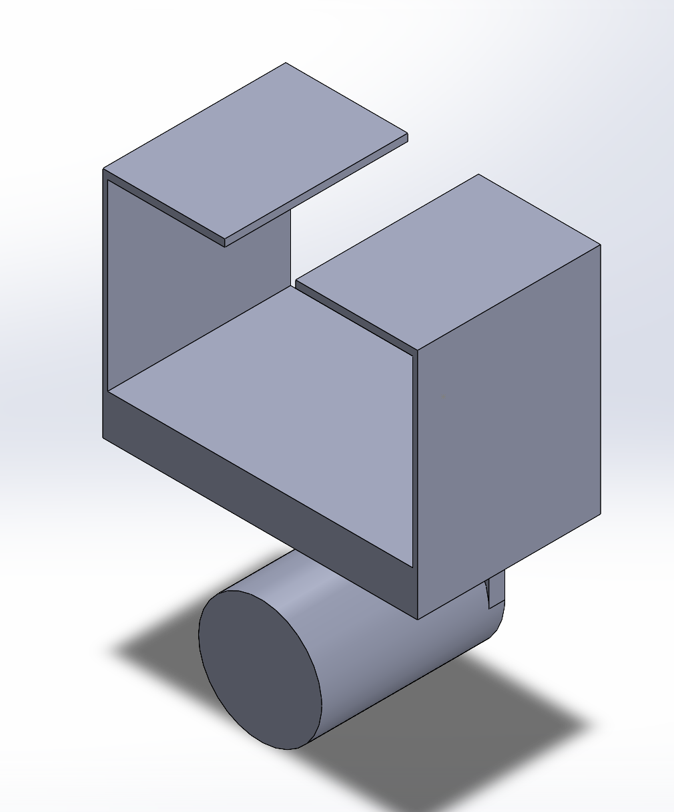
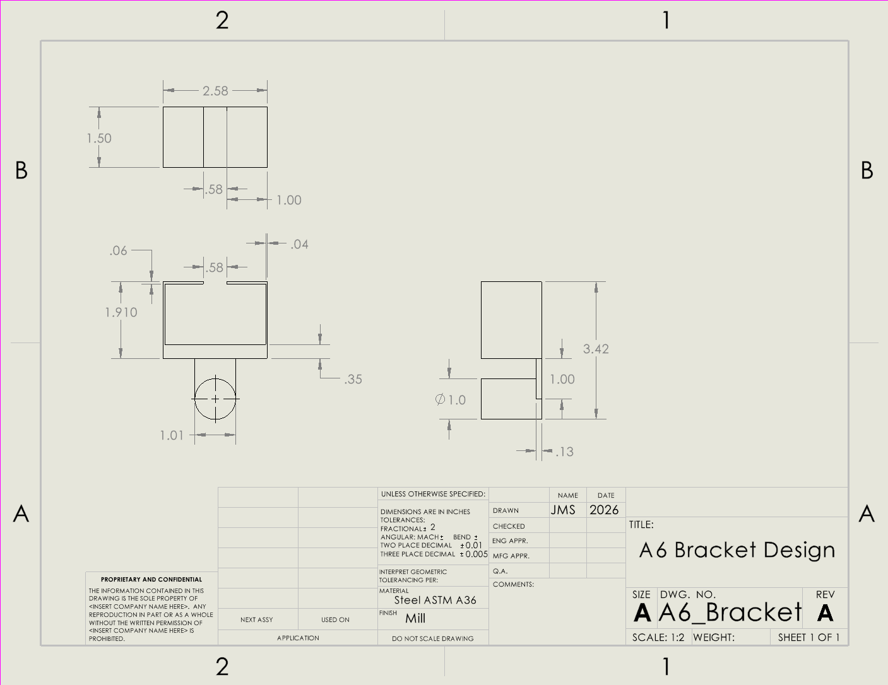

# A6 – Bracket Drawing

## Objective

The objective of this assignment was to take the results from last weeks assignment and create a drawing in third angle projection after utilizing parametric design in SolidWorks.  For my model, I used my stress calculations since those were determined to be my governing calculations.

## Parametric Design

First, I needed to take my work from last week and recreate it in CAD. The majority of my dimensions came directly from the equations tab.  I had no issues translating my work for the first three features, but D and E would take a while because I wasn't satisfied with their extra long design.

For this feature, I had to make a slight change to the height.  After the initial extrusion, I found the part to be short enough that feature A and C would be touching.  Because of this, I made the executive decision to double the height so that there was enough room for the remaining features to not interfere with each other.

I came to the unfortunate realization that I had left out an important piece of both this weeks and last weeks assignment, showing the dimensions of the T-beam that needed to fit inside the bracket.  This was a large part of why my bracket was so tall, so by reworking feature D and E, I was able to get my bracket a little more accurate to the given specifications.  The downside was that the thickness for both was incredibly thin compared to the rest of the bracket.  This was concerning, but I couldn't do much about it since that is what my results came to while allowing the beam to slide into the bracket.

For both this feature and the previous one, I swapped between methods of modeling them multiple times.  For example, I wasn't sure If I should design feature C to include the entire bottom surface, or let it be fitted between the two symmetrical extrusions of D.  I opted for the latter.

## Drawing

This is my completed drawing.  I found with a little research that third angle projection didn't require an isometric view, so I didn't include one.  I filled out as much information as I could in the title block.  I was cautious not to repeat dimensions across the different projections and make sure they were spaced out and easy to digest. I also made a note to highlight the most prominent dimensions in each view.

[A6_Bracket Drawing](A6_Bracket.SLDDRW)

[A6_Bracket Model](A6_Bracket.SLDPRT)

## Reflection

To find the width of feature D, I used the axial stress formula P/A.  Since this was a direct connection to the height of D, putting the equations under the global variables allowed me to change the width automatically when I readjusted the height of D to the given value c from the appendix.  I applied three decimal tolerance to the height of feature D because it was crucial to making sure the T beam fit into the bracket and wasn't too short.  I applied a less strict tolerance to the diameter of feature A because it didn't need to fit into any other parts, so it wasn't as significant to the functionality of the bracket.  A stricter tolerance means a more expensive part.  The more exact the dimension needs to be, the more time and machining is required.  Applying this across the board means a significantly more expensive part that is wasting resources on parts that don't require as much attention.

This assignment took me 5 hours.
